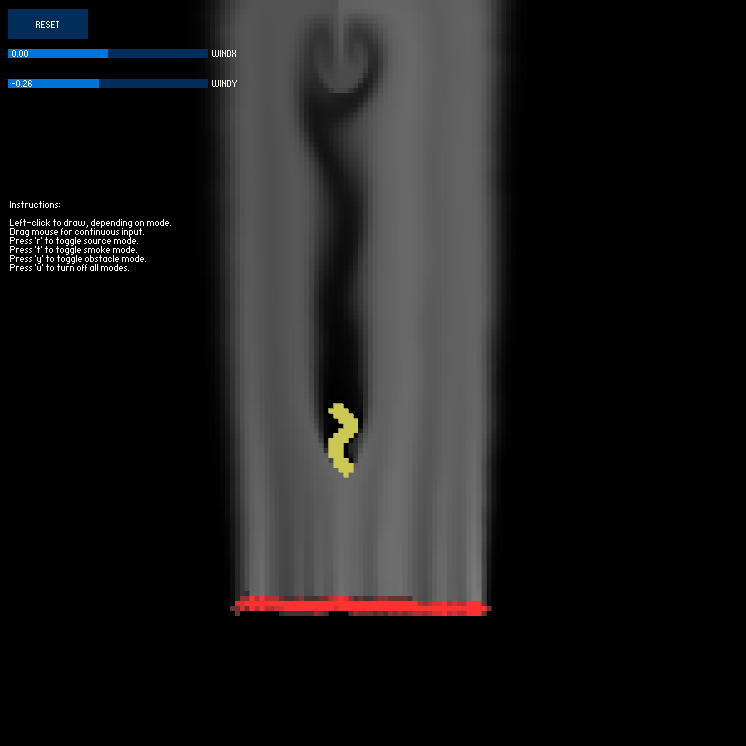

# SmokeSimulation

A Semi-Lagrangian smoke simulation created by Omar Salem and Jacob Brott

The project webpage can be found [here](https://sites.google.com/umn.edu/smoke-simulation)

## Usage

The ControlP5 library was used to create GUI elements

This must be installed before running or else the simulation won't start

To do so, after opening the Processing editor, you can go to `Sketch > Import Library > Manage Libraries` and you can search for the `ControlP5` library and install it
